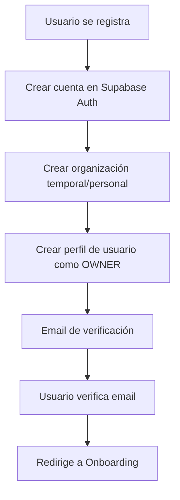
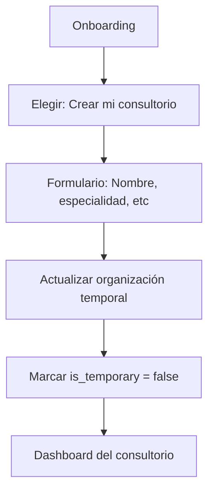
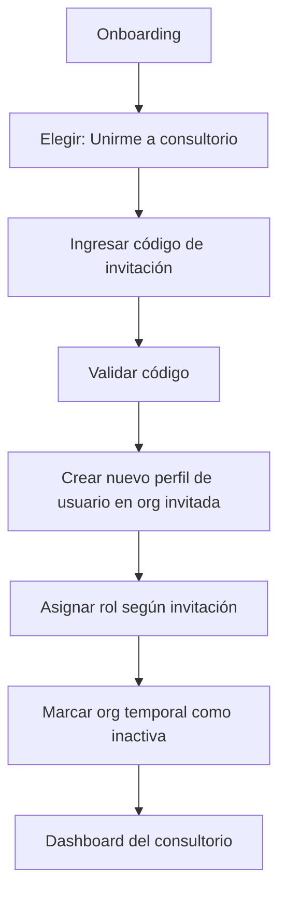
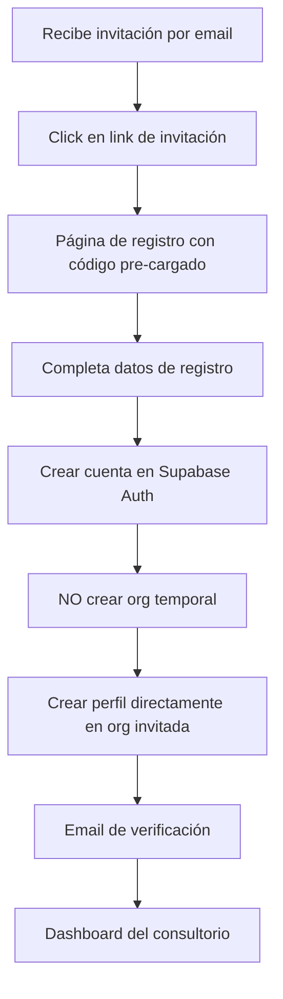

# Arquitectura Multi-Tenant de ClinqApp

## 📋 Resumen

ClinqApp usa un modelo multi-tenant donde:
- Cada **organización** representa un consultorio/clínica
- Múltiples **usuarios** pueden pertenecer a una organización
- Un **usuario** puede pertenecer a múltiples organizaciones (con diferentes roles)

## 🏗️ Estructura de Datos

```
Organization (Consultorio)
  ├── User 1 (OWNER) - Dr. Juan Pérez
  ├── User 2 (PROFESSIONAL) - Dra. María García
  └── User 3 (RECEPTIONIST) - Ana López
```

## 🔄 Flujos de Registro

### Flujo 1: Registro Inicial (Nuevo Usuario)



**Organización temporal creada:**
```json
{
  "name": "Juan Pérez's Consultorio",
  "slug": "org-temp-12345",
  "is_temporary": true, // Campo especial
  "subscription_plan": "FREE_TRIAL",
  "subscription_status": "TRIALING"
}
```

### Flujo 2: Onboarding (Después de verificar email)

El usuario tiene 2 opciones:

#### Opción A: Crear Mi Consultorio



**Actualización:**
```sql
UPDATE organizations
SET
  name = 'Clínica Podológica San Martín',
  specialty = 'PODIATRY',
  is_temporary = false,
  -- otros campos configurados
WHERE id = user_organization_id;
```

#### Opción B: Unirme a un Consultorio Existente



**Proceso:**
```typescript
// 1. Crear nuevo perfil en organización invitada
INSERT INTO users (
  auth_id,
  email,
  organization_id, // ID de la org que invitó
  role // Rol asignado en la invitación
);

// 2. Marcar organización temporal como inactiva
UPDATE organizations
SET deleted_at = NOW()
WHERE id = temp_organization_id;
```

### Flujo 3: Usuario Invitado (Sin cuenta previa)



## 🗂️ Cambios en el Schema

### Agregar campo `is_temporary` a Organizations

```prisma
model Organization {
  // ... campos existentes

  isTemporary Boolean @default(false) @map("is_temporary")

  // ... resto de campos
}
```

### Tabla de Invitaciones

```prisma
model Invitation {
  id             String   @id @default(uuid()) @db.Uuid
  createdAt      DateTime @default(now()) @map("created_at") @db.Timestamptz
  expiresAt      DateTime @map("expires_at") @db.Timestamptz

  // Organización que invita
  organizationId String       @map("organization_id") @db.Uuid
  organization   Organization @relation(fields: [organizationId], references: [id])

  // Usuario que envió la invitación
  invitedById    String @map("invited_by_id") @db.Uuid
  invitedBy      User   @relation("InvitationsSent", fields: [invitedById], references: [id])

  // Datos de invitación
  email          String
  role           UserRole
  code           String  @unique // Código único de invitación

  // Estado
  status         InvitationStatus @default(PENDING)
  acceptedAt     DateTime? @map("accepted_at") @db.Timestamptz
  acceptedById   String?   @map("accepted_by_id") @db.Uuid
  acceptedBy     User?     @relation("InvitationsAccepted", fields: [acceptedById], references: [id])

  @@map("invitations")
  @@index([organizationId])
  @@index([email])
  @@index([code])
}

enum InvitationStatus {
  PENDING
  ACCEPTED
  REJECTED
  EXPIRED
}
```

## 🎯 Casos de Uso Reales

### Caso 1: Dr. Juan - Podólogo Independiente
```
1. Se registra en ClinqApp
2. Verifica su email
3. Onboarding: "Crear mi consultorio"
4. Configura: "Clínica Podológica Dr. Juan"
5. Trabaja solo
```

### Caso 2: Dra. María - Se une a una clínica
```
1. Recibe invitación de "Centro Médico San Pablo"
2. Click en link, se registra
3. Automáticamente unida a la organización
4. Rol: PROFESSIONAL
5. Ve pacientes del centro
```

### Caso 3: Centro Médico - Múltiples Profesionales
```
Owner (Dr. Carlos):
  1. Se registra, crea "Centro Médico Salud Total"
  2. Invita a 3 doctores (PROFESSIONAL)
  3. Invita a 1 recepcionista (RECEPTIONIST)

Invitados:
  - Se registran mediante invitación
  - Todos ven los mismos pacientes
  - Cada uno tiene su agenda
  - Permisos según su rol
```

### Caso 4: Dr. Juan - Multi-consultorio
```
Dr. Juan puede:
  1. Tener su propio consultorio (OWNER)
  2. Trabajar en Centro Médico A (PROFESSIONAL)
  3. Trabajar en Centro Médico B (PROFESSIONAL)

Al iniciar sesión:
  - Ve un selector de organización
  - Cambia entre consultorios
  - Datos aislados por organización
```

## 🔐 Seguridad y RLS

### Políticas de Row Level Security

```sql
-- Los usuarios solo ven datos de su(s) organización(es)
CREATE POLICY "Users see own organization data"
  ON patients FOR SELECT
  USING (
    organization_id IN (
      SELECT organization_id
      FROM users
      WHERE auth_id = auth.uid()
    )
  );
```

## 📊 Ventajas de Esta Arquitectura

✅ **Flexible**: Soporta desde 1 usuario hasta organizaciones grandes
✅ **Escalable**: Un usuario puede pertenecer a múltiples organizaciones
✅ **Simple para empezar**: Usuario puede registrarse y empezar inmediatamente
✅ **Colaborativo**: Fácil invitar y gestionar equipo
✅ **Aislamiento de datos**: Cada organización ve solo sus datos
✅ **Multi-rol**: Un usuario puede tener diferentes roles en diferentes organizaciones

## 🚀 Roadmap de Implementación

### Fase 1 (Actual - MVP)
- [x] Registro básico
- [x] Una organización por usuario
- [x] Usuario siempre es OWNER

### Fase 2 (Onboarding)
- [ ] Agregar campo `is_temporary` a organizations
- [ ] Página de onboarding
- [ ] Opción: "Crear consultorio" o "Unirme a consultorio"
- [ ] Actualizar organización temporal

### Fase 3 (Invitaciones)
- [ ] Crear tabla `invitations`
- [ ] Sistema de generación de códigos únicos
- [ ] Email de invitación
- [ ] Página de aceptar invitación
- [ ] Registro con código de invitación

### Fase 4 (Multi-organización)
- [ ] Selector de organización en navbar
- [ ] Cambiar entre organizaciones
- [ ] Ver rol en cada organización
- [ ] Permisos basados en rol

## 🎨 UI/UX Propuesta

### Onboarding Screen

```
┌─────────────────────────────────────┐
│   ¡Bienvenido a ClinqApp, Juan!    │
│                                     │
│   ¿Cómo quieres empezar?           │
│                                     │
│  ┌───────────────────────────────┐ │
│  │  🏥 Crear mi consultorio      │ │
│  │                               │ │
│  │  Configura tu propio          │ │
│  │  consultorio o clínica        │ │
│  └───────────────────────────────┘ │
│                                     │
│  ┌───────────────────────────────┐ │
│  │  🤝 Unirme a un consultorio   │ │
│  │                               │ │
│  │  Tengo un código de           │ │
│  │  invitación de mi equipo      │ │
│  └───────────────────────────────┘ │
└─────────────────────────────────────┘
```

### Multi-org Selector

```
┌─────────────────────────────────┐
│  Juan Pérez                     │
│  juan@email.com            ▼   │
├─────────────────────────────────┤
│  🏥 Consultorio Dr. Juan        │
│     └─ OWNER                    │
│                                 │
│  🏥 Centro Médico San Pablo    │
│     └─ PROFESSIONAL             │
│                                 │
│  ➕ Crear nuevo consultorio     │
└─────────────────────────────────┘
```

## ❓ Preguntas Frecuentes

**¿Qué pasa si un usuario se registra y luego recibe invitación?**
- Puede aceptar la invitación y tener acceso a ambas organizaciones

**¿Un usuario puede ser OWNER de múltiples consultorios?**
- Sí, puede crear múltiples organizaciones

**¿Cómo se manejan los datos cuando un usuario pertenece a múltiples orgs?**
- Los datos están completamente aislados por organización
- Al cambiar de org, ve solo los datos de esa org

**¿Qué pasa con la organización temporal si nunca completa el onboarding?**
- Se puede auto-eliminar después de 30 días de inactividad

**¿Puedo invitar a alguien que ya tiene cuenta?**
- Sí, simplemente se le agrega a tu organización con el rol especificado

---

**Próximo paso**: ¿Implementamos la Fase 2 (Onboarding)?
